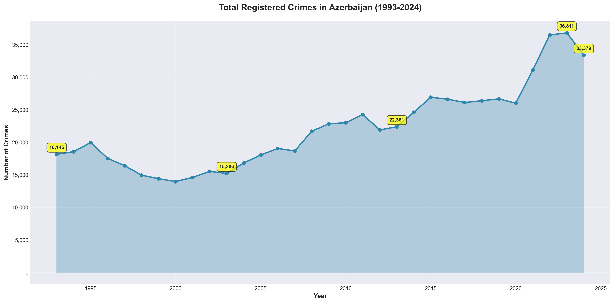
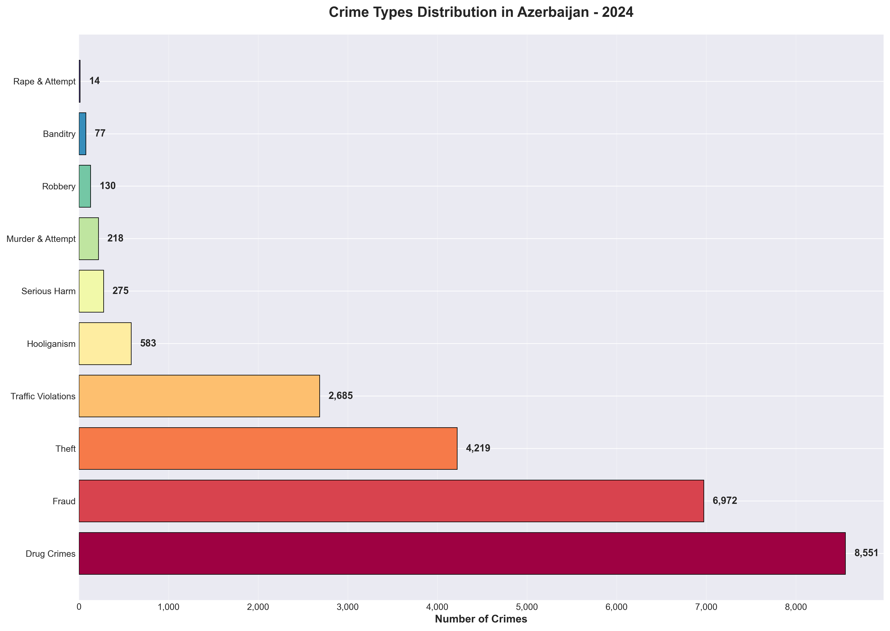
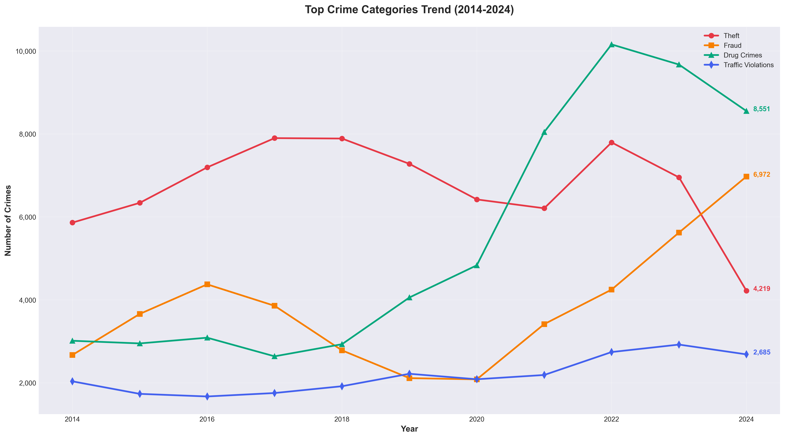
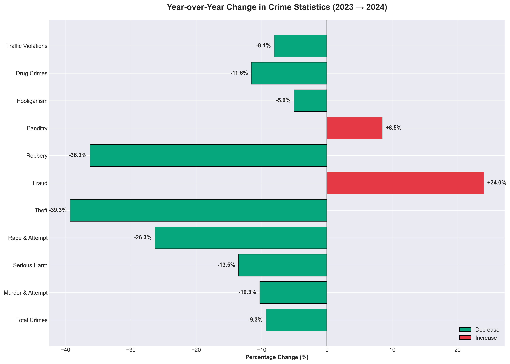
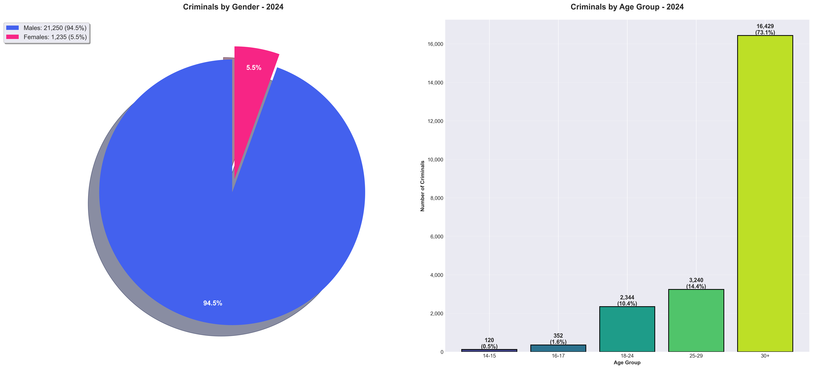
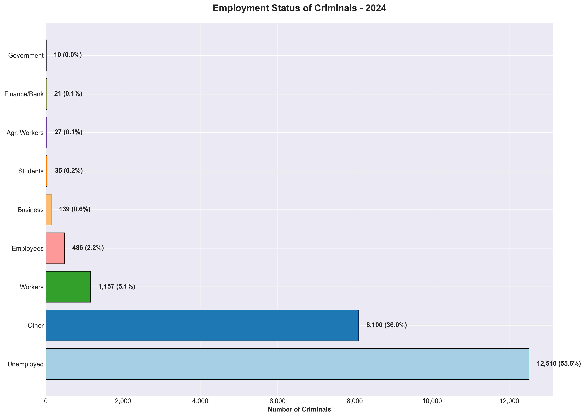
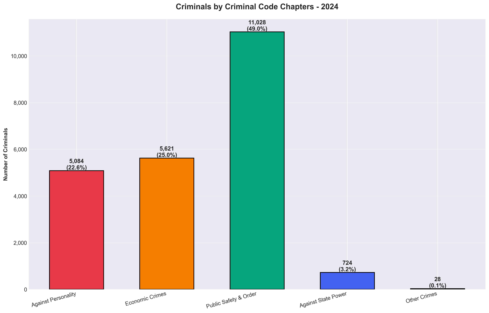
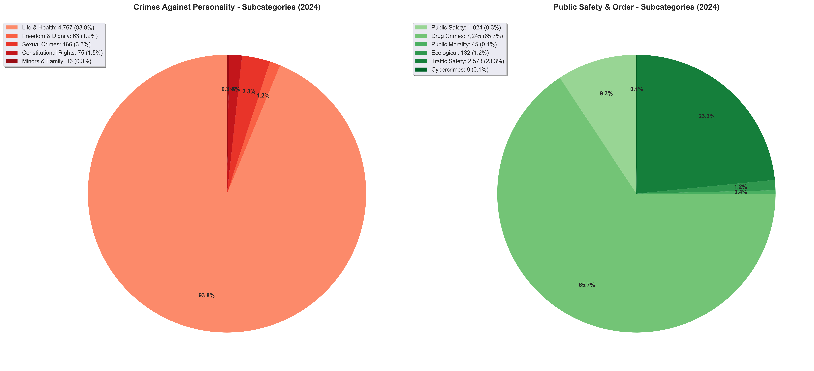
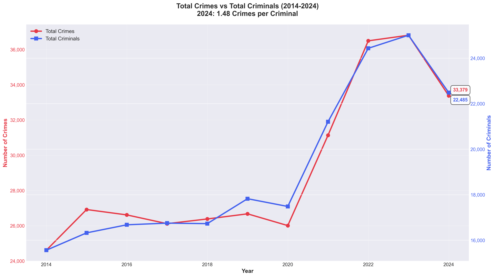
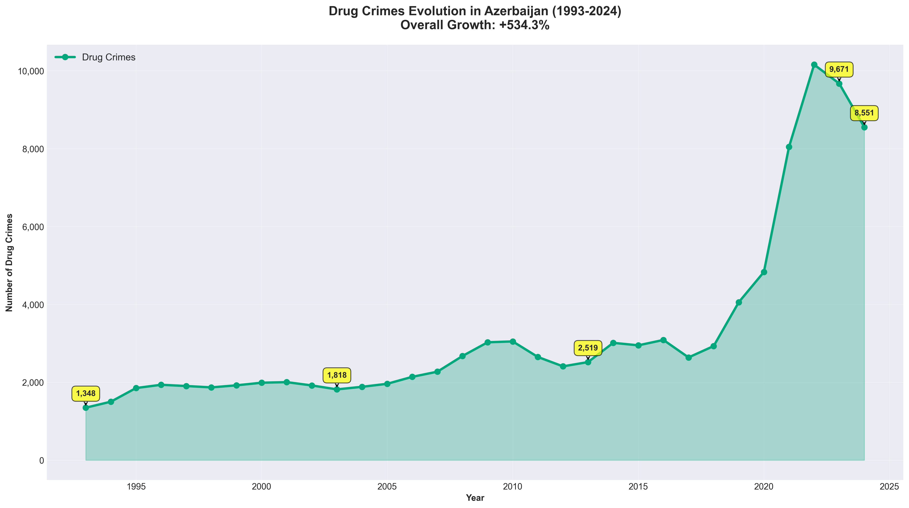

# Crime Statistics Analysis - Azerbaijan 🇦🇿
## Comprehensive Data Analysis & Visualization (1993-2024)

---

## 📊 Executive Summary

This repository presents a comprehensive analysis of crime statistics in Azerbaijan spanning over three decades (1993-2024). The analysis is based on 5 official datasets containing detailed information about registered crimes, criminals, and their socio-demographic characteristics.

### 🎯 Key Findings 2024

| Metric | Value | Change from 2023 |
|--------|-------|------------------|
| **Total Registered Crimes** | 33,379 | -9.3% ⬇️ |
| **Total Identified Criminals** | 22,485 | -10.1% ⬇️ |
| **Crimes per Criminal** | 1.48 | Stable |
| **Drug Crimes** | 8,551 | -11.6% ⬇️ |
| **Fraud Cases** | 6,972 | +24.0% ⬆️ |
| **Theft Cases** | 4,219 | -39.3% ⬇️ |

---

## 📈 1. Crime Trends Overview

### Total Registered Crimes (1993-2024)



**Key Observations:**
- ✅ **Overall decrease in 2024**: Total crimes dropped from 36,811 (2023) to 33,379 (2024)
- 📊 **Historical peak**: Highest recorded in 2022 with 36,494 crimes
- 📉 **Historical low**: Lowest in 1998-2000 period (~14,000-14,400 crimes)
- 📈 **Long-term trend**: Gradual increase from 2010 onwards, with recent stabilization

---

## 🔍 2. Crime Type Distribution

### Crime Categories in 2024



**Top 3 Crime Categories:**
1. **Drug Crimes**: 8,551 cases (25.6% of total)
2. **Fraud**: 6,972 cases (20.9% of total)
3. **Theft**: 4,219 cases (12.6% of total)

**Notable Patterns:**
- 🔴 Drug-related crimes remain the dominant category
- 🔴 Fraud shows significant presence and growth
- 🟢 Violent crimes (murder, rape, serious harm) relatively low
- 🟡 Traffic violations constitute 8.0% of all crimes

---

### Top Crime Trends (2014-2024)



**Trend Analysis:**
- **Drug Crimes**: Peaked in 2023 (9,671), slight decrease in 2024
- **Fraud**: Consistent upward trend since 2014, +65% increase over 10 years
- **Theft**: Declining significantly from peak of 7,898 (2017) to 4,219 (2024), -47% decrease
- **Traffic Violations**: Relatively stable around 2,500-2,900 annually

---

## 📊 3. Year-over-Year Changes (2023 → 2024)



### 🟢 Positive Developments (Decreased Crimes):
- **Total Crimes**: -9.3%
- **Murder & Attempted Murder**: -10.3%
- **Drug Crimes**: -11.6%
- **Theft**: -39.3% (significant drop)
- **Rape & Attempted Rape**: -26.3%
- **Serious Harm to Health**: -13.5%

### 🔴 Areas of Concern (Increased Crimes):
- **Fraud**: +24.0% (significant increase)
- **Banditry**: +8.5%
- **Hooliganism**: -5.0% (slight decrease)

---

## 👥 4. Criminal Demographics

### Gender & Age Distribution



**Gender Profile (2024):**
- **Males**: 21,250 (94.5%)
- **Females**: 1,235 (5.5%)

**Age Profile (2024):**
- **14-15 years**: 120 (0.5%)
- **16-17 years**: 352 (1.6%)
- **18-24 years**: 2,344 (10.4%)
- **25-29 years**: 3,240 (14.4%)
- **30+ years**: 16,429 (73.1%) ⚠️ Largest group

**Key Insight**: Over 73% of criminals are aged 30 and above, indicating mature offender profile.

---

### Employment Status of Criminals



**Employment Breakdown (2024):**
1. **Unemployed**: 12,510 (55.6%) ⚠️ **Critical finding**
2. **Other**: 8,100 (36.0%)
3. **Workers**: 1,157 (5.1%)
4. **Employees**: 486 (2.2%)
5. **Students**: 35 (0.2%)
6. **Business Owners**: 139 (0.6%)
7. **Government Workers**: 10 (0.04%)

**Critical Insight**: More than half of all criminals are unemployed, highlighting strong correlation between unemployment and criminal activity.

---

## ⚖️ 5. Criminal Code Categories

### Main Categories by Criminal Code Chapters



**Distribution by Legal Framework (2024):**
1. **Public Safety & Order**: 11,028 criminals (49.0%)
2. **Economic Crimes**: 5,621 criminals (25.0%)
3. **Against Personality**: 5,084 criminals (22.6%)
4. **Against State Power**: 724 criminals (3.2%)
5. **Other Crimes**: 28 criminals (0.1%)

---

### Detailed Crime Subcategories



**Crimes Against Personality Breakdown:**
- **Life & Health crimes**: 93.9% (4,767 criminals)
- **Sexual crimes**: 3.3% (166 criminals)
- **Freedom & Dignity**: 1.2% (63 criminals)
- **Constitutional Rights**: 1.5% (75 criminals)
- **Minors & Family**: 0.3% (13 criminals)

**Public Safety & Order Breakdown:**
- **Drug crimes**: 65.7% (7,245 criminals) - Dominant subcategory
- **Traffic safety**: 23.3% (2,573 criminals)
- **Public safety**: 9.3% (1,024 criminals)
- **Ecological crimes**: 1.2% (132 criminals)
- **Public morality**: 0.4% (45 criminals)
- **Cybercrimes**: 0.1% (9 criminals) - Emerging category

---

## 📊 6. Crimes vs Criminals Analysis

### Comparison: Registered Crimes vs Identified Criminals



**Key Metrics (2024):**
- **Total Crimes**: 33,379
- **Total Criminals**: 22,485
- **Ratio**: 1.48 crimes per criminal

**Interpretation:**
- On average, each identified criminal is associated with ~1.5 crimes
- Some criminals commit multiple offenses
- The gap between crimes and criminals has remained relatively stable
- Both metrics show declining trends in 2024

---

## 🚨 7. Special Focus: Drug Crimes

### Drug Crime Evolution (1993-2024)



**Historical Analysis:**
- **1993**: 1,348 drug crimes
- **2024**: 8,551 drug crimes
- **Overall Growth**: +534.5% over 31 years

**Critical Periods:**
- 📈 **2015-2023**: Rapid escalation from 2,918 to 9,671 (+232%)
- 📉 **2023-2024**: First significant decrease (-11.6%)

**Current Status:**
- Drug crimes constitute **25.6%** of all registered crimes
- **7,245 criminals** involved in drug-related activities
- Remains the #1 crime category in Azerbaijan

---

## 📋 8. Data Quality & Methodology

### Dataset Overview

| Dataset | Description | Time Period | Records |
|---------|-------------|-------------|---------|
| **003_1.xls** | Registered Crimes by Main Types | 1993-2024 | 18 categories |
| **003_3.xls** | Criminals by Criminal Code Chapters | 2005-2024 | 31 categories |
| **003_4.xls** | Crimes by Perpetrator Characteristics | 1993-2024 | 12 characteristics |
| **003_10.xls** | Criminals by Crime Types | 1993-2024 | 19 types |
| **003_11.xls** | Criminals by Demographics | 1993-2024 | 24 attributes |

### ⚠️ Important Data Considerations

**In-Row Aggregation Patterns:**
- Datasets contain **hierarchical totals and subtotals**
- "onlardan" (of which) indicates subset relationships
- "o cümlədən" (including) marks category breakdowns
- **Critical**: Avoid double-counting nested categories

**Example Hierarchy:**
```
Total Crimes (Row 3) = 33,379
├─ Murder & Attempted Murder (Row 5) = 218
│  └─ Of which: Intentional Murder (Row 6) = 161  ⚠️ SUBSET
├─ Theft (Row 9) = 4,219
├─ Fraud (Row 10) = 6,972
└─ Traffic Violations (Row 15) = 2,685
   └─ Of which: Resulting in Death (Row 16) = 621  ⚠️ SUBSET
```

**Data Completeness:**
- "..." symbol indicates data not collected for that period
- Some categories introduced in later years
- Traffic violations only include criminal cases (not all violations)

---

## 💡 9. Key Insights & Recommendations

### 🎯 Major Findings

1. **Drug Crisis Dominance**
   - Drug crimes represent 1 in 4 crimes
   - Despite recent decrease, remains at critically high levels
   - Requires sustained intervention strategies

2. **Fraud Epidemic**
   - 24% increase in 2024 despite overall crime decrease
   - Likely driven by digital/online fraud growth
   - Demands enhanced cybersecurity and awareness

3. **Unemployment-Crime Correlation**
   - 55.6% of criminals are unemployed
   - Strong indicator for intervention: job creation & vocational training
   - Economic development could significantly reduce crime

4. **Positive Trends**
   - Overall crime reduction in 2024 (-9.3%)
   - Violent crimes declining
   - Theft down significantly (-39.3%)
   - Youth crime relatively low (2.1% aged 14-17)

5. **Demographic Profile**
   - 94.5% male offenders
   - 73% aged 30+
   - Mature offender profile suggests need for adult-focused rehabilitation

### 📌 Recommendations

**Short-term (0-1 year):**
- ✅ Strengthen anti-fraud task forces
- ✅ Enhance digital literacy campaigns
- ✅ Expand drug rehabilitation programs
- ✅ Increase employment support for at-risk populations

**Medium-term (1-3 years):**
- 🎯 Develop targeted interventions for unemployed demographics
- 🎯 Modernize law enforcement technology for fraud detection
- 🎯 Establish community-based crime prevention programs
- 🎯 Improve data collection for cybercrime tracking

**Long-term (3+ years):**
- 🔮 Comprehensive employment generation strategies
- 🔮 National drug prevention and treatment framework
- 🔮 Digital infrastructure for real-time crime monitoring
- 🔮 Social rehabilitation programs for ex-offenders

---

## 📂 10. Repository Structure

```
crime_types_analyse/
├── .gitignore                     # Git ignore rules
├── README.md                      # This presentation document (main)
│
├── data/                          # Raw data files and technical docs
│   ├── 003_1.xls                  # Crimes by types (1993-2024)
│   ├── 003_3.xls                  # Criminals by Criminal Code (2005-2024)
│   ├── 003_4.xls                  # Crimes by perpetrator type (1993-2024)
│   ├── 003_10.xls                 # Criminals by crime type (1993-2024)
│   ├── 003_11.xls                 # Criminal demographics (1993-2024)
│   └── DATASET_ANALYSIS.md        # Detailed technical documentation
│
├── charts/                        # Generated visualization charts (PNG)
│   ├── 01_total_crimes_trend.png          # 32-year crime trend
│   ├── 02_crime_types_2024.png            # Current crime distribution
│   ├── 03_top_crimes_trend.png            # Top 4 crimes (2014-2024)
│   ├── 04_demographics_gender_age.png     # Criminal demographics
│   ├── 05_employment_status.png           # Employment breakdown
│   ├── 06_criminal_code_categories.png    # Legal categorization
│   ├── 07_crime_subcategories.png         # Detailed subcategories
│   ├── 08_crimes_vs_criminals.png         # Comparative analysis
│   ├── 09_year_over_year_change.png       # 2023→2024 changes
│   └── 10_drug_crimes_evolution.png       # Drug crime 32-year trend
│
└── scripts/                       # Analysis and visualization scripts
    └── generate_charts.py         # Chart generation script (executable)
```

### 📝 How to Regenerate Charts

To regenerate all charts from the data:

```bash
# Navigate to project directory
cd crime_types_analyse

# Run the chart generation script
python3 scripts/generate_charts.py
```

**Requirements:**
- Python 3.x
- pandas
- matplotlib
- numpy

**Install dependencies:**
```bash
pip install pandas matplotlib numpy openpyxl xlrd
```

---

## 🔧 Technical Details

**Analysis Tools:**
- **Data Processing**: Python 3.x + Pandas
- **Visualization**: Matplotlib + NumPy
- **File Format**: Excel (.xls) → PNG charts
- **Resolution**: 300 DPI (publication quality)

**Chart Specifications:**
- High-resolution PNG format
- Clear value labels on all data points
- Color-coded for accessibility
- Professional presentation quality

---

## 📊 Statistical Summary Table

| Category | 1993 | 2003 | 2013 | 2023 | 2024 | 31-Year Change |
|----------|------|------|------|------|------|----------------|
| **Total Crimes** | 18,145 | 15,206 | 22,381 | 36,811 | 33,379 | +84.0% |
| **Murder** | 478 | 183 | 211 | 178 | 161 | -66.3% |
| **Theft** | 4,943 | 1,819 | 5,144 | 6,951 | 4,219 | -14.6% |
| **Fraud** | 355 | 412 | 807 | 5,622 | 6,972 | +1,863.7% |
| **Drug Crimes** | 1,348 | 1,537 | 2,527 | 9,671 | 8,551 | +534.5% |
| **Traffic** | 1,512 | 1,197 | 2,064 | 2,921 | 2,685 | +77.6% |

---

## 📞 Contact & Attribution

**Data Source**: Official Azerbaijan Crime Statistics
**Analysis Period**: 1993-2024 (32 years)
**Last Updated**: December 2024
**Analysis Conducted By**: Data Analytics Team

---

## 🏁 Conclusion

The crime statistics for Azerbaijan (1993-2024) reveal a complex landscape with both encouraging improvements and persistent challenges:

### ✅ Positive Trends:
- Overall crime reduction in 2024
- Significant decrease in violent crimes
- Declining theft rates
- Reduced drug crimes from 2023 peak

### ⚠️ Areas Requiring Attention:
- High unemployment among criminals (55.6%)
- Rapid growth in fraud cases (+24% in 2024)
- Persistent drug crime burden (25.6% of all crimes)
- Mature offender demographics (73% aged 30+)

### 🎯 Priority Actions:
1. Combat fraud through enhanced digital security
2. Address unemployment-crime correlation
3. Sustain drug crime reduction efforts
4. Develop evidence-based prevention programs

---

**For detailed technical analysis and data methodology, see [DATASET_ANALYSIS.md](data/DATASET_ANALYSIS.md)**

---

*This analysis is based on official statistics and uses advanced data visualization techniques to present comprehensive insights for policymakers, researchers, and stakeholders.*

---

## 📄 License & Usage

This analysis is for informational and research purposes. Charts and data may be used with proper attribution.

---

**Generated with comprehensive data analysis and professional visualization tools** | **December 2024**
